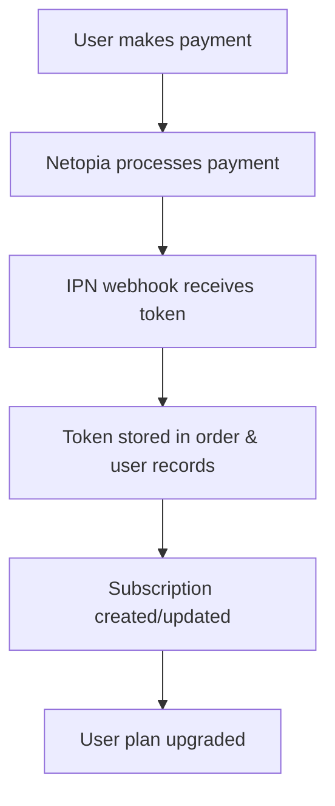
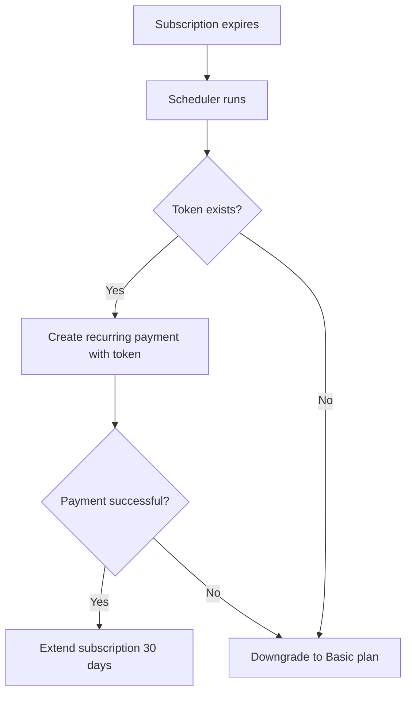

# 🔄 Recurring Payments System Setup

## Overview

This system automatically handles recurring payments for user subscriptions using Netopia tokens. When a user makes their first payment, a token is captured and stored for future automatic charges every 30 days.

## ✅ What We've Implemented

### 1. **Token Capture System**
- ✅ Updated `order.js` to extract tokens from Netopia IPN responses
- ✅ Modified webhooks to store tokens in order records
- ✅ Added logging to track token capture

### 2. **Database Schema Updates** (Needs Migration)
```prisma
model User {
  // ... existing fields ...
  recurringToken String?      // Token for recurring payments from Netopia
  tokenExpiry    DateTime?    // Token expiration date
  phone          String?      // Phone number for billing
  address        String?      // Address for billing
  postalCode     String?      // Postal code for billing
}

model Order {
  // ... existing fields ...
  tokenExpiry     DateTime?     // Token expiration date
  paidAt          DateTime?     // When payment was completed
  paymentMethod   String?       // Payment method used
  transactionId   String?       // Transaction ID from payment provider
  failureReason   String?       // Reason for payment failure
  recurringSubscriptionId String? @db.ObjectId // Link to subscription
}
```

### 3. **Recurring Payment APIs**
- ✅ `/api/payments/recurring` - Process individual recurring payments
- ✅ `/api/admin/recurring-payments` - Admin endpoint for manual processing
- ✅ `scripts/recurring-payments-scheduler.js` - Standalone scheduler script

## 🚀 Setup Instructions

### Step 1: Update Database Schema
```bash
# Update the Prisma schema with the new fields
npx prisma db push

# Generate new Prisma client
npx prisma generate
```

### Step 2: Environment Variables
Add to your `.env` file:
```env
# Recurring payments
ADMIN_SECRET=your-admin-secret-key
CRON_SECRET=your-cron-secret-key

# Netopia API (already configured)
NETOPIA_API_KEY=your-api-key
NETOPIA_POS_SIGNATURE=your-pos-signature
```

### Step 3: Test Token Capture
1. Make a test payment for any plan
2. Check the logs for token capture:
   ```
   [NETOPIA_IPN] Processed payment data: {
     token: "ODM1ODQ6LtecwxydXCSI...",
     tokenExpiryMonth: 12,
     tokenExpiryYear: 2031
   }
   ```
3. Verify token is stored in the database

## 🔄 How It Works

### 1. **First Payment (Token Capture)**


### 2. **Recurring Payment (Every 30 Days)**


## 🛠️ Usage

### Manual Testing
```bash
# Check which subscriptions need renewal
curl -H "Authorization: Bearer your-admin-secret" \
  http://localhost:3000/api/admin/recurring-payments

# Manually process recurring payments
curl -X POST \
  -H "Authorization: Bearer your-admin-secret" \
  http://localhost:3000/api/admin/recurring-payments
```

### Automated Scheduling
Set up a cron job to run every day:
```bash
# Add to crontab (crontab -e)
0 9 * * * cd /path/to/your/app && node scripts/recurring-payments-scheduler.js
```

Or use a service like Vercel Cron:
```javascript
// vercel.json
{
  "crons": [
    {
      "path": "/api/admin/recurring-payments",
      "schedule": "0 9 * * *"
    }
  ]
}
```

## 📊 Monitoring

### Check Token Status
```sql
-- Users with recurring tokens
SELECT email, planType, recurringToken IS NOT NULL as hasToken, tokenExpiry
FROM User 
WHERE recurringToken IS NOT NULL;

-- Recent orders with tokens
SELECT orderId, amount, subscriptionType, token IS NOT NULL as hasToken, status
FROM Order 
WHERE isRecurring = true 
ORDER BY createdAt DESC;
```

### Subscription Status
```sql
-- Active subscriptions ending soon
SELECT u.email, s.plan, s.endDate, s.status
FROM Subscription s
JOIN User u ON s.userId = u.id
WHERE s.status = 'active' 
AND s.endDate <= DATE_ADD(NOW(), INTERVAL 7 DAY);
```

## 🔧 Troubleshooting

### Token Not Captured
1. Check IPN logs for token fields
2. Verify webhook is receiving the correct data format
3. Ensure Netopia has enabled recurring payments for your account

### Payment Failures
1. Check token expiry dates
2. Verify user billing information is complete
3. Monitor Netopia API responses for error codes

### User Downgrades
Users are automatically downgraded to Basic plan when:
- No recurring token is found
- Token has expired
- Payment fails 
- Any error occurs during processing

## 📈 Next Steps

1. **Email Notifications**: Add email alerts for payment failures and downgrades
2. **Retry Logic**: Implement retry attempts for failed payments
3. **Grace Period**: Add a grace period before downgrading users
4. **Admin Dashboard**: Create a UI for monitoring recurring payments
5. **Webhook Security**: Add signature verification for Netopia webhooks

## 🎯 Current Status

✅ **Working**: Token capture from payments  
✅ **Working**: Database schema designed  
✅ **Working**: Recurring payment logic  
✅ **Working**: Automatic downgrade system  
⏳ **Pending**: Database migration  
⏳ **Pending**: Production testing  
⏳ **Pending**: Cron job setup  

The system is ready for testing once the database schema is updated! 