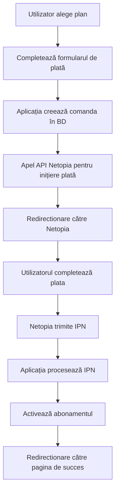

# Integrarea Netopia pentru Plăți Recurente

Acest document descrie implementarea sistemului de plăți Netopia pentru abonamente recurente lunare în aplicația VOC.

## Arhitectura Sistemului

### Componente Principale

1. **lib/netopia.ts** - Biblioteca principală pentru integrarea cu API-ul Netopia
2. **components/NetopiaPaymentForm.tsx** - Componenta pentru redirectionarea către Netopia
3. **app/api/payment/route.ts** - API pentru inițierea plăților
4. **app/api/netopia/ipn/route.ts** - Webhook pentru notificările IPN de la Netopia
5. **app/api/netopia/return/route.ts** - Endpoint pentru return URL-ul de la Netopia
6. **app/api/cron/recurring-payments/route.ts** - Cron job pentru plăți recurente

### Fluxul de Plată



## Configurarea Mediului

### Variabile de Mediu Necesare

Adaugă următoarele variabile în fișierul `.env`:

```env
# Netopia Configuration
NETOPIA_API_KEY=your_api_key_here
NETOPIA_POS_SIGNATURE=your_pos_signature_here

# Application URLs
NEXT_PUBLIC_APP_URL=http://localhost:3000
NETOPIA_NOTIFY_URL=http://localhost:3000/api/netopia/ipn
NETOPIA_RETURN_URL=http://localhost:3000/api/netopia/return

# Cron Security
CRON_SECRET=your_secret_for_cron_protection
```

### Configurarea Netopia

1. **Obțineți credențialele**:
   - Accesați panoul de administrare Netopia
   - Generați API Key în secțiunea Profile -> Security
   - Copiați POS Signature-ul

2. **Configurați URL-urile de callback**:
   - IPN URL: `https://your-domain.com/api/netopia/ipn`
   - Return URL: `https://your-domain.com/api/netopia/return`

## Implementarea

### 1. Popularea Planurilor de Abonament

Rulați următoarea comandă pentru a popula planurile în baza de date:

```bash
# Prin script
npx tsx lib/seed-plans.ts

# Sau prin API (necesită acces de admin)
curl -X POST http://localhost:3000/api/admin/seed-plans \
  -H "Authorization: Bearer your_admin_token"
```

### 2. Actualizarea Bazei de Date

Dacă doriți să folosiți câmpurile suplimentare pentru token-uri recurente, rulați:

```bash
npx prisma db push
```

### 3. Configurarea Cron Job-ului

Pentru plățile recurente automate, configurați un cron job care să apeleze:

```bash
# Zilnic la 08:00
0 8 * * * curl -X POST https://your-domain.com/api/cron/recurring-payments \
  -H "Authorization: Bearer $CRON_SECRET"
```

Sau folosiți un serviciu de cron online precum Vercel Cron sau GitHub Actions.

## Utilizarea API-ului

### Inițierea unei Plăți

```javascript
const response = await fetch('/api/payment', {
  method: 'POST',
  headers: {
    'Content-Type': 'application/json',
  },
  body: JSON.stringify({
    subscriptionType: 'Premium',
    billingInfo: {
      firstName: 'John',
      lastName: 'Doe',
      email: 'john@example.com',
      phone: '0700000000',
      address: 'Strada Exemplu 1',
      city: 'București',
      postalCode: '010000'
    },
    isRecurring: true
  })
});

const data = await response.json();
if (data.success) {
  // Redirectionează către Netopia
  // Folosește NetopiaPaymentForm component
}
```

### Verificarea Statusului unei Plăți

```javascript
const response = await fetch(`/api/payment?orderId=${orderId}`);
const order = await response.json();
console.log('Status comandă:', order.status);
```

## Gestionarea Erorilor

### Coduri de Eroare Netopia

- `00` - Succes
- `01` - În curs de procesare
- `02` - În așteptare
- `03` - Anulată
- `04` - Respinsă
- `05` - Rambursată

### Gestionarea Eșecurilor

Sistemul gestionează automat:
- **Reîncercări**: Până la 3 tentative pentru plăți recurente eșuate
- **Anulare automată**: După 3 eșecuri consecutive
- **Notificări**: Email-uri de confirmare și eșec (de implementat)

## Securitatea

### Validarea IPN

```javascript
// IPN-urile sunt validate automat în webhook
const ipnData = netopia.processIPN(encryptedData);
if (!ipnData) {
  // IPN invalid
  return new NextResponse("Invalid IPN", { status: 400 });
}
```

### Protecția Cron Job-ului

```javascript
const authHeader = req.headers.get('authorization');
if (authHeader !== `Bearer ${process.env.CRON_SECRET}`) {
  return new NextResponse("Unauthorized", { status: 401 });
}
```

## Testarea

### Carduri de Test Netopia

Pentru mediul sandbox, folosiți:
- **Card valid**: 4444333322221111
- **CVV**: 123
- **Expiry**: 12/2025

### Testarea IPN-urilor

```bash
# Simulează un IPN de succes
curl -X POST http://localhost:3000/api/netopia/ipn \
  -H "Content-Type: application/json" \
  -d '{"test_ipn": true}'
```

## Monitorizarea

### Logs Importante

Sistemul logează:
- `[PAYMENT_SUCCESS]` - Plată inițiată cu succes
- `[IPN_RECEIVED]` - IPN primit de la Netopia
- `[RECURRING_CRON]` - Execuția cron job-ului pentru plăți recurente

### Dashboard de Monitorizare

Accesați `/api/cron/recurring-payments` (GET) pentru statistici:

```json
{
  "status": "healthy",
  "statistics": {
    "activeRecurring": 15,
    "pendingPayments": 3,
    "failedRecurring": 2
  }
}
```

## Troubleshooting

### Probleme Comune

1. **IPN-urile nu ajung**:
   - Verificați configurarea URL-urilor în panoul Netopia
   - Asigurați-vă că aplicația este accesibilă public

2. **Plăți care nu se activează**:
   - Verificați logs-urile IPN
   - Confirmați că webhook-ul procesează corect statusurile

3. **Plăți recurente eșuate**:
   - Verificați configurarea cron job-ului
   - Asigurați-vă că token-urile sunt salvate corect

### Debugging

Activați logging-ul detaliat:

```javascript
console.log('[DEBUG]', {
  orderId,
  status,
  ipnData,
  timestamp: new Date().toISOString()
});
```

## Roadmap

### Funcționalități Viitoare

- [ ] Integrare cu sistemul de email pentru notificări
- [ ] Dashboard admin pentru gestionarea plăților
- [ ] Rapoarte detaliate de vânzări
- [ ] Suport pentru discount-uri și cupoane
- [ ] Integrare cu sistemul de facturare

## Suport

Pentru probleme tehnice:
- Consultați documentația oficială Netopia: https://doc.netopia-payments.com/
- Verificați logs-urile aplicației
- Contactați echipa de dezvoltare 